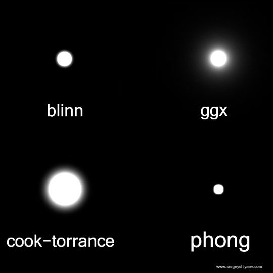

# 材质
  * ## VRayMtl
    * ### [BDRF(通用材质)](https://www.zhihu.com/question/48050245)
      
    * ### Fresnel Reflection(菲涅尔反射)
      ##### 使物体的中间反射弱，而边缘的反射强
      ##### 例如绒布或者丝绸，绒布和丝绸没有明显的反射，但是却有明显的高光，并且只有边缘有高光，中间没有，这样的情况就可以用菲涅尔反射来模拟
